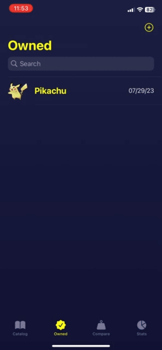

    

# SwiftUI Pokédex by Ryan Balieiro

This demo project showcases the setup of the SwiftUI framework with the Clean MVVM architecture.

## Key Features

- The app's UI is entirely built with SwiftUI.
- CoreData is used for saving and managing data.
- It dynamically fetches and updates the Pokémon catalog from the cloud.
- Combine is used for handling network interactions.
- The whole design is focused on scalability for future growth.

## Project Overview

The project is organized into these groups:

- **Data**: Handles saving and loading local data with CoreData.
- **Helpers**: Contains useful methods, constants, and extensions that can be reused across the app.
- **Models**: Manages the core functionality and business logic.
- **Network**: Responsible for getting data from the server.
- **ViewModels**: Bridges the gap between the app’s logic and the user interface.
- **Views**: Focuses on displaying data to users.

## Screenshots

The app supports both dark and light modes, automatically adjusting to match the user’s preferences. Here are the main screens for each display mode:

## Preview

Just like the original Pokédex, it gives you detailed profiles and stats for every Pokémon, covering their types, abilities, evolution stages, base stats, and more:

## Copyright and License

Code released under the [MIT](https://github.com/ryanbalieiro/SwiftUI-Pokedex/blob/main/LICENSE) license. This means you're welcome to use, modify, and distribute the code, provided the original license and copyright notice are included.

